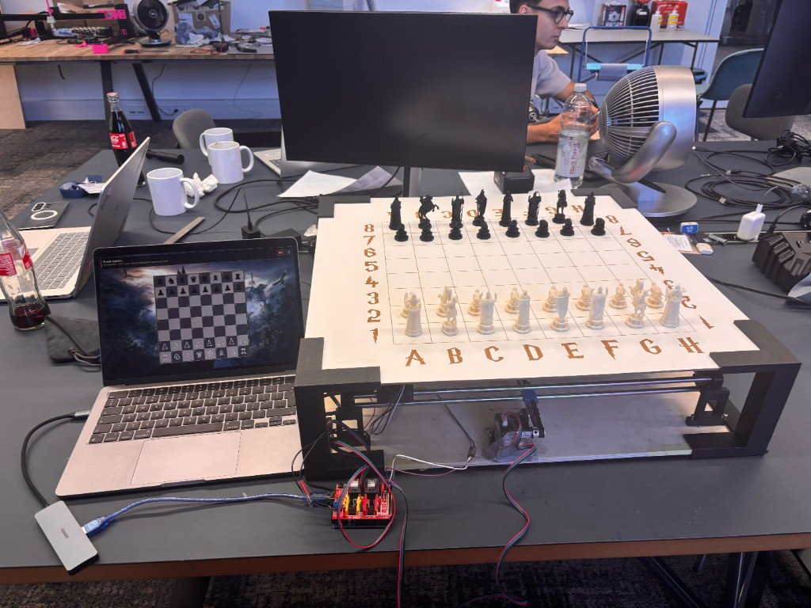
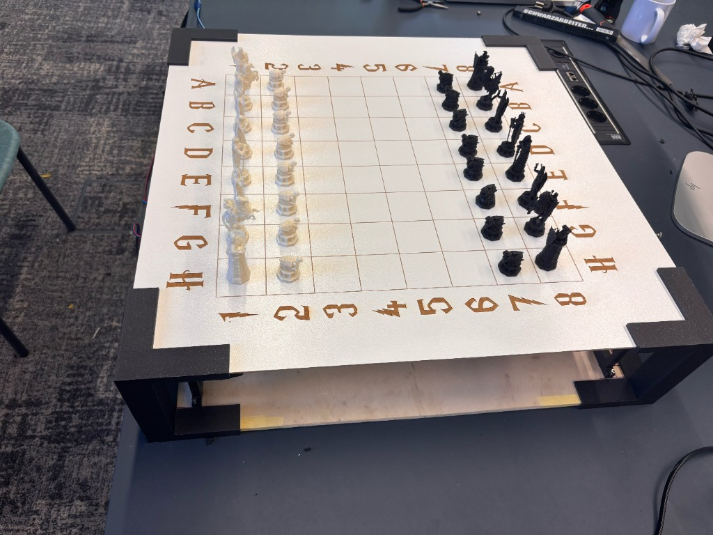
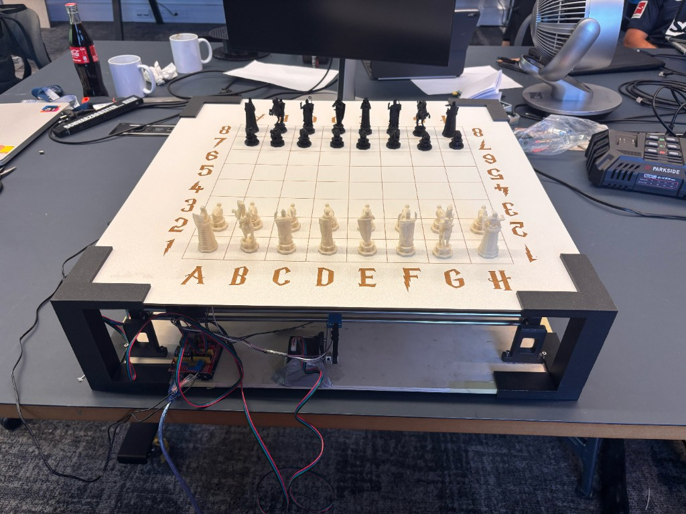

# Wizard Chess — Voice-Controlled Physical Chess Robot

An end-to-end mechatronics and software system: speak a chess move, watch it execute on a custom XY gantry, and play against Stockfish. The same stack runs without hardware via a robot simulator.

<p align="center">
  
</p>

<p align="center">
  
  &nbsp;
  
</p>

## Project Documentation

- **Project presentation:** [Slides](CPS%20Submission/Slides.pdf)
- **Demonstration video:** [Chess Video Compressed](CPS%20Submission/Chess%20Video%20Compressed.mp4)
- **Technical documentation:** coming soon (PDF to be uploaded)

---

## What this repository is

This is not a chess UI demo. It is a **closed-loop product**: speech and mouse input, full chess legality, engine play, a themed desktop client, and a GRBL-driven Cartesian robot that physically transports pieces (including captures and knight path planning).

Recruiters scanning this repo should see:

| Layer | What shipped |
| --- | --- |
| **Mechanical** | Open-frame board, linear rails, belts, magnet carriage under the surface |
| **Embedded** | Arduino + CNC shield, GRBL G-code, serial protocol, feed-hold E-stop |
| **Motion planning** | Square-to-mm calibration, capture removal off the board, collision-aware knight routes |
| **Software architecture** | Game logic never talks to serial; it talks to `RobotInterface` |
| **AI / perception** | Local faster-whisper (offline STT) + Stockfish UCI |
| **Product UX** | Pygame client, turn-phase state machine, narration, mouse fallback |

Human plays White. Stockfish plays Black. The physical board and the pygame board stay in sync.

---

## System architecture

```
Microphone / mouse
        │
        ▼
 SpeechRecognizer          BoardGUI (pygame)
 (faster-whisper, thread)         │
        │                         │
        └────────► GameController ◄──────── Stockfish (UCI)
                         │
                         │ python-chess (rules)
                         ▼
                   RobotInterface
                    ├── SerialRobot  → GRBL / Arduino / steppers
                    └── RobotSimulator  → terminal log (no hardware)
```

**Turn phases** (`core/controller.py`) gate the microphone so speech never races the gantry or the engine:

`HUMAN_TURN` → `HUMAN_PROCESSING` → `ROBOT_MOVING` → `ENGINE_WAITING` → `ENGINE_MOVING` → (repeat)  
Invalid speech enters `SPEECH_COOLDOWN`. Checkmate / timeout → `GAME_OVER`.

Robot motion runs on a **dedicated worker thread** with a lock and an abort path for emergency stop.

---

## Hardware

Cartesian (CNC-style) gantry under a 40 cm play area (8 × 50 mm squares):

- Linear rails, belts, pulleys, and a carriage that carries a magnet to drag pieces
- Arduino-class MCU with a CNC shield and stepper drivers (GRBL firmware)
- USB serial at 115200 baud; work coordinates zeroed at the board’s bottom-left corner (`G92`)
- GUI **E-stop** maps to GRBL real-time feed hold (`!`)

Calibration lives in `chess_voice_robot/config.py` (`SQUARE_SIZE_MM`, origin offsets, axis polarity, feed rate, settle time). Park the carriage at the bottom-left corner of the board before starting so work zero matches the physical park position.

### Motion that is not “just A to B”

- **Captures:** the captured piece is planned off the board first (`robot/capture_removal.py`), including en passant.
- **Knights:** pieces cannot jump physically. The planner uses a direct long-leg path, or a half-square side offset when the long-leg squares are occupied (`robot/knight_path.py`).

---

## Software stack

| Package | Role |
| --- | --- |
| `python-chess` | Rules: legality, castling, en passant, promotion, FEN |
| `faster-whisper` | On-device speech-to-text (no cloud; first run downloads the model) |
| `pygame` | Themed board, legal-move highlights, mic / E-stop controls |
| `pyserial` | GRBL command/response, idle polling |
| Stockfish (system binary) | Opponent engine |

Speech is parsed to UCI (`e2e4`) from phrases such as “e two e four”, “move e2 to e4”, or “e seven e eight queen”.

---

## Repository layout

```
chess_voice_robot/
├── main.py                 # composition root: GUI, speech, engine, robot
├── config.py               # paths, theme, speech, GRBL, millimetre geometry
├── core/controller.py      # turn-phase state machine + robot worker
├── chess_engine/game.py    # python-chess wrapper
├── speech/speech_recognizer.py
├── ai/stockfish_engine.py
├── ui/board_gui.py
├── robot/
│   ├── interface.py        # hardware abstraction
│   ├── serial_robot.py     # GRBL + square mapping
│   ├── simulator.py        # no-hardware path
│   ├── capture_removal.py
│   ├── knight_path.py
│   └── grbl_log.py
└── utils/move_parser.py, audio.py
```

---

## Setup

### 1. Python 3.10+

```bash
cd /path/to/Chess-board
python3 -m venv venv
source venv/bin/activate
pip install -r requirements.txt
```

### 2. PyAudio (microphone)

**macOS**

```bash
brew install portaudio
pip install PyAudio
```

### 3. Stockfish

**macOS**

```bash
brew install stockfish
```

**Linux**

```bash
sudo apt install stockfish
```

Optional custom path:

```bash
export STOCKFISH_PATH=/opt/homebrew/bin/stockfish
```

### 4. Speech model

Speech uses **faster-whisper** locally (no internet after the first download, ~150 MB for `base`).

```bash
export WHISPER_MODEL=small    # tiny | base | small | medium | large-v3
export WHISPER_DEVICE=cpu     # cpu or cuda
export WHISPER_COMPUTE_TYPE=int8
```

---

## Run

Always start from the project root with the virtual environment active:

```bash
cd /path/to/Chess-board
source venv/bin/activate
```

### Without Arduino (simulator — virtual board only)

Use this when the Arduino is unplugged or you only want to test speech, chess rules, and the GUI. Robot moves are printed to the terminal instead of driving motors.

```bash
cd /path/to/Chess-board
source venv/bin/activate
USE_ROBOT_SIMULATOR=1 python -m chess_voice_robot.main
```

You should see `[Robot] Using simulator (no hardware).` in the terminal.

### With Arduino connected (real motors)

1. Plug in the Arduino running **GRBL** firmware.
2. Close **UGS** or any other app using the serial port.
3. Park the carriage at the bottom-left corner of the board.
4. Set the port in `chess_voice_robot/config.py` (`SERIAL_PORT`) or override it:

```bash
cd /path/to/Chess-board
source venv/bin/activate
python -m chess_voice_robot.main

# Custom port for this session
SERIAL_PORT=/dev/tty.usbmodemXXXX python -m chess_voice_robot.main
```

Find the port on macOS:

```bash
ls /dev/tty.usb*
```

You should see `[Robot] Connecting to GRBL on ...` in the terminal. Spoken moves and Stockfish replies drive the carriage from the source square to the destination.

**Quick motor test** (no speech/GUI — sends `e2 → e4`):

```bash
python -m chess_voice_robot.robot.serial_robot
```

### Gameplay

Speak as **White** when the status bar shows your turn:

- `"e two e four"`
- `"e2 e4"`
- `"move e2 to e4"`
- Promotion: `"e seven e eight queen"`

Silence the mic (**M** or the 🎤 control) to play with the mouse. Close the pygame window to exit.

### In-game UI

- Status bar: gold = your turn (speak or click); muted = opponent / robot in motion
- Computer waits `ENGINE_MOVE_DELAY` seconds before moving
- After an invalid move, the mic pauses so stale audio is not treated as a new command
- E-stop halts GRBL immediately

---

## Robot hardware config

Tune physical setup in `chess_voice_robot/config.py`:

| Variable | Purpose |
| --- | --- |
| `SERIAL_PORT` | Arduino serial port |
| `SQUARE_SIZE_MM` | Distance between square centres (mm) |
| `BOARD_ORIGIN_X_MM` / `BOARD_ORIGIN_Y_MM` | Machine coordinates of square `a1` |
| `ORIGIN_OFFSET_X_MM` / `ORIGIN_OFFSET_Y_MM` | Shift from board math to work zero (a1 centre) |
| `X_AXIS_DIRECTION` / `Y_AXIS_DIRECTION` | `1` or `-1` to flip axis direction |
| `MOVE_FEED_RATE` | Speed in mm/min (`0` = GRBL default) |
| `MOVE_SETTLE_TIME` | Seconds to wait after each move |
| `USE_ROBOT_SIMULATOR` | `1` to skip serial hardware |

Environment overrides:

```bash
export SERIAL_PORT=/dev/tty.usbmodemXXXX
export USE_ROBOT_SIMULATOR=1
```

---

## Design choices worth noting

- **Interface over implementation.** Game code depends on `RobotInterface`. Hardware and simulator are interchangeable without touching chess or speech.
- **Offline by default.** Whisper and Stockfish run on-device; the robot only needs USB serial.
- **Safety and concurrency.** Mic is gated while motors run; serial I/O is locked; E-stop is a real-time GRBL command, not a queued G-code line.
- **Physical chess ≠ digital chess.** Knights and captures need extra trajectories so magnets do not collide with standing pieces.
